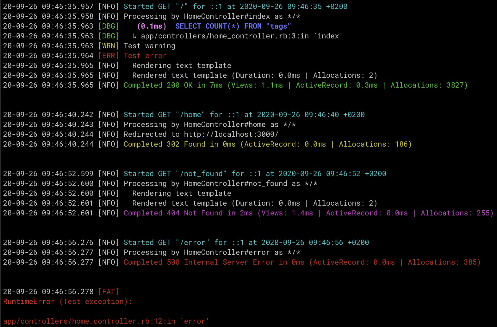

# CompactLogFormatter [](https://badge.fury.io/rb/compact_log_formatter)
A Compact Log Formatter for Rails.

## Usage
- Add to `Gemfile` (and execute `bundle`):
```rb
gem 'compact_log_formatter'
```
- Add to `application.rb` or to `config/environments/some_env.rb`:
```rb
Rails.logger = Logger.new("log/#{Rails.env}.log")
Rails.logger.formatter = CompactLogFormatter::Formatter.new
```

## Screenshot


## Do you like it? Star it!
If you use this component just star it. A developer is more motivated to improve a project when there is some interest.

## Contributors
- [Mattia Roccoberton](https://blocknot.es/): author

## License
The gem is available as open source under the terms of the [MIT License](https://opensource.org/licenses/MIT).
